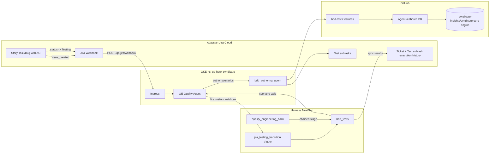

# GitHub <-> Jira <-> QE Agent <-> Harness on GKE — Integration Guide

This document describes how GitHub, Jira, the QE Agent, and Harness are wired
for event-driven BDD test authoring and execution.

## High-level architecture



## What runs where

| System | Location | Purpose |
|---|---|---|
| `qe-quality-agent` Deployment | GKE, `qe-hack-syndicate` | Hosts deterministic `/qe/...` API and ADK sub-agents, including `bdd_authoring_agent`. |
| `qe-quality-agent` Ingress | GKE (GCP External LB) | Exposes `https://qe-agent.astom.tools/qe/jira/webhook` and `/healthz` for Jira Cloud callbacks. |
| `quality_engineering_hack` pipeline | Harness NextGen | Main quality gate (5 deterministic stages), then chains `bdd_tests`. |
| `bdd_tests` pipeline | Harness NextGen | Runs Maven Cucumber tests from `bdd-tests/` and publishes reports. |
| `jira_testing_transition` trigger | Harness NextGen | Custom Webhook trigger that starts `bdd_tests` for a Jira ticket moved to `Testing`. |
| Jira Cloud | SaaS | Source of acceptance criteria and status transitions; receives test result sync. |
| GitHub | SaaS | Stores code and receives agent-authored PRs for generated/updated features. |

## End-to-end flow

### 1. Ticket created -> feature authoring

1. Jira emits `issue_created` to:
  `https://qe-agent.astom.tools/qe/jira/webhook?token=<JIRA_WEBHOOK_TOKEN>`.
2. Agent verifies token and reads acceptance criteria.
3. Agent generates `.feature` files under:
   `bdd-tests/src/test/resources/feature/<Domain>/<slug>.feature`.
4. Agent creates Jira `Test` subtasks and opens a PR with new/updated features.

Manual equivalent:

```bash
qe-cli jira author SYN-123
qe-cli jira author SYN-123 --dry-run
```

### 2. Ticket moved to Testing -> BDD pipeline run

1. Jira emits `issue_updated` with status transition to `Testing`.
2. Agent listener detects transition and POSTs to `HARNESS_BDD_WEBHOOK_URL`.
3. Harness trigger `jira_testing_transition` maps `issue.key` into `jiraTicket`.
4. `bdd_tests` runs Cucumber and syncs results via:
   `POST /qe/jira/<ticket>/sync-results`.

### 3. Main quality gate also runs BDD

`quality_engineering_hack` chains `bdd_tests` as the final stage, so merges can
run deterministic suites and then the BDD pack.

## Setup

### 1. Create/update secrets

```bash
kubectl -n qe-hack-syndicate create secret generic qe-quality-agent-secrets \
  --from-literal=NEO4J_PASSWORD='...' \
  --from-literal=JIRA_API_TOKEN='...' \
  --from-literal=HARNESS_API_KEY='...' \
  --from-literal=HARNESS_ACCOUNT_ID='...' \
  --from-literal=GITHUB_TOKEN='...' \
  --from-literal=JIRA_WEBHOOK_TOKEN="$(openssl rand -hex 32)" \
  --from-literal=HARNESS_BDD_WEBHOOK_URL='<paste-from-harness-trigger>'
```

### 2. Configure ConfigMap values

Set in `qe-agent/deploy/k8s/configmap.yaml`:

- `JIRA_BASE_URL`, `JIRA_USER`, `JIRA_PROJECT`
- `JIRA_TESTING_STATUS=Testing`
- `JIRA_TRIGGER_ISSUETYPES=Story,Task,Bug`
- `HARNESS_ORG_ID=default`
- `HARNESS_PROJECT_ID=QE_HACK`
- `HARNESS_BDD_PIPELINE_ID=bdd_tests`
- `GITHUB_REPO=syndicate-insights/syndicate-core-engine`

### 3. Apply K8s manifests

```bash
kubectl apply -f qe-agent/deploy/k8s/configmap.yaml
kubectl apply -f qe-agent/deploy/k8s/deployment.yaml
kubectl apply -f qe-agent/deploy/k8s/service.yaml
kubectl apply -f qe-agent/deploy/k8s/ingress.yaml

# get the external load balancer IP to use in Jira webhook URL
kubectl -n qe-hack-syndicate get ingress qe-quality-agent-webhook
```

### 4. Harness Git Experience sync

Harness should track:

- `.harness/orgs/default/projects/QE_HACK/pipelines/quality_engineering_hack.yaml`
- `.harness/orgs/default/projects/QE_HACK/pipelines/bdd_tests.yaml`
- `.harness/orgs/default/projects/QE_HACK/triggers/jira_testing_transition.yaml`

After saving the trigger, copy its webhook URL into `HARNESS_BDD_WEBHOOK_URL`.

### 5. Jira webhook setup

In Jira: Settings -> System -> WebHooks -> Create:

- URL: `https://qe-agent.astom.tools/qe/jira/webhook?token=<JIRA_WEBHOOK_TOKEN>`
- Events: `Issue created`, `Issue updated`
- JQL: `project = SYN AND issuetype in (Story, Task, Bug)`
- Include payload body: enabled

### 6. Smoke tests

```bash
qe-cli jira author SYN-123 --dry-run
qe-cli jira author SYN-123
qe-cli harness latest
```
